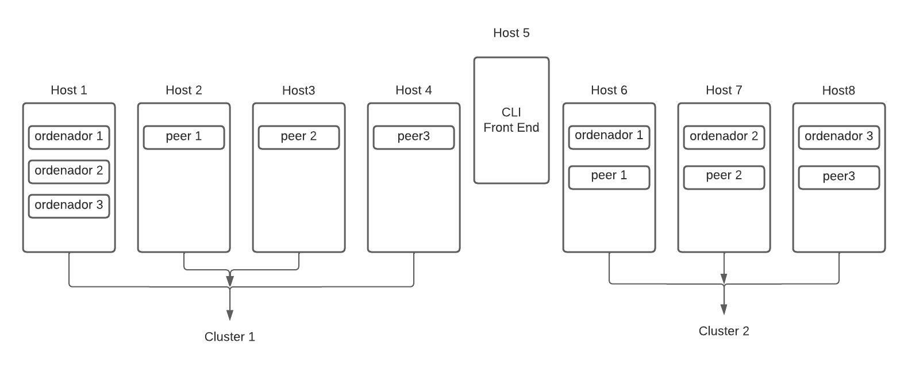

# 4hlf-clusters-multihosts

## Construção de Rede Hyperledger Fabric em Dois Clusters

O ambiente necessita de 8 hosts ou máquinas virtuais (VMs) para manter dois clusters (Cluster 1 e Cluster 2) funcionando simultaneamente. Contudo, pode-se utilizar apenas 5 hosts e montar um dos clusters por vez. A figura abaixo mostra a topologia e o papel dos hosts em cada cluster para uma rede Hyperledger Fabric.

## Instruções de Configuração

### 1 - Iniciar docker swarm

#### No host 1:

    docker swarm init --advertise-addr <host-1 ip address>
    docker swarm join-token manager - Usado no próximo comando

#### Nos hosts restantes:

    <output from join-token manager> --advertise-addr <host n ip>

### 2 - Criar overlay

#### No host1:

    docker network create --attachable --driver overlay first-network

### 3 - Instalando o fabric em cada host

**OBS:** Estes passos devem ser feitos em todos os hosts.

#### 3.1 - Instalar o fabric, o docker e o jq:

    sudo apt install docker.io

Para usar o docker sem sudo:

    sudo usermod -aG docker ${USER}

Para instalar o jq

    sudo apt install jq

Instalar o fabric

    sudo curl -sSLO https://raw.githubusercontent.com/hyperledger/fabric/main/scripts/install-fabric.sh

    sudo chmod +x install-fabric.sh

    sudo ./install-fabric.sh docker samples binary

#### Para instalar uma versão específica:

    sudo ./install-fabric.sh --fabric-version 2.3.0 docker samples binary

### 4 - Levantando cada nó

Clone o repositório do projeto dentro de fabric-samples:

    git clone https://github.com/Ericksulino/4hlf-clusters-multihosts.git

Em cada nó host, execute seu respectivo script:

    cd ~/fabric-samples/4hlf-clusters-multihosts
    ./host[n]up-c[i].sh

Onde `n` é o número do host e `i` é o número do cluster.

### 5 - Criando o canal

Descubra o host com o container “cli”. Para isso, execute o comando “docker ps” nos hosts e verifique onde há um container com esse nome.

Entre na pasta fabric_samples/4hlf-clusters-multihosts e execute o comando:

    cd ~/fabric-samples/4hlf-clusters-multihosts
    ./mychannelup.sh

Verifique o canal em cada host:

    docker exec peerx.orgy.example.com peer channel getinfo -c mychannel

Onde `X` é o número do peer e `Y` o número da org.

### 6 - Instalando o chaincode 

Para instalar o chaincode usado aqui que é o asset-transfer-basic, basta apenas rodar o shell script abaixo no host onde foi executado o comando anterior:

    ./chaincode.sh
